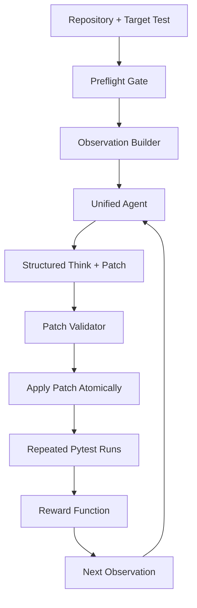

# FlakeForge: Teaching an RL Agent to Repair Flaky Tests

Flaky tests silently break CI pipelines.

They pass on one run, fail on the next, and leave developers asking the worst debugging question: "What changed?" Most teams respond with retries, larger timeouts, skipped tests, or long manual investigations. Those fixes may quiet the pipeline, but they rarely explain the real root cause.

FlakeForge was built around a different idea: treat flaky-test repair as an interactive reinforcement-learning environment, where an agent must inspect evidence, propose a causal explanation, apply a minimal patch, and prove the fix through repeated execution.

The goal is not to make a model sound confident. The goal is to make the test suite stable.

---

## 1. The Problem: Flaky Tests Are Not Normal Bugs

A deterministic bug is straightforward compared with a flaky one. If a test fails every time, the failure is at least reproducible. You can trace it, patch it, and rerun it.

Flaky tests are different. They live in the gaps between runs:

- A timeout appears only when the machine is under load.
- A shared global counter keeps state from a previous test.
- A mock remains patched after teardown.
- A test passes alone but fails when another test runs first.
- A socket, file handle, thread, or event loop survives longer than expected.
- A dictionary, set, random seed, timestamp, or scheduler changes the execution path.

This is why flaky tests are so expensive. The failure is not just in the code. It is in the interaction between code, runtime, order, timing, environment, and test harness.

The painful part is that the symptom often points to the wrong place. A stack trace may end at an assertion, but the cause may be a stale cache, an import side effect, a fixture scope leak, or a race several calls earlier.

That makes flaky-test repair a strong environment-design problem: the agent needs observations that expose hidden state and transitions that verify whether a patch actually improved stability.

---

## 2. Why Existing Solutions Fall Short

Most teams already have tools for flaky tests, but each one solves only part of the problem.

### Retries Hide the Symptom

Retries are useful for reducing CI noise, but they are not a repair strategy. If a test passes after three attempts, the pipeline turns green while the underlying nondeterminism remains. Over time, the project accumulates tests that are "green enough" instead of trustworthy.

### Static Analysis Misses Runtime Behavior

Static analysis can flag risky patterns such as mutable globals, unsafe fixture scopes, unclosed resources, or import-time side effects. But flaky behavior often depends on execution order, scheduling, timing, and environment pressure. A static warning can tell us where to look, not whether the test is actually unstable.

### Heuristic Debugging Does Not Learn

Rule-based tools can catch common cases, but they struggle when the fix requires combining signals: stack traces, repeated pass rates, failure entropy, causal call chains, and patch validation. A flaky bug may look like a timeout but actually be a race. It may look like a network issue but actually be a missing mock.

### LLM-Only Repair Is Too Easy to Game

A language model can generate plausible explanations and patches, but plausible is not enough. If the reward is another model's opinion, the agent can learn to write convincing narratives instead of correct repairs. In software repair, the final judge should be executable evidence.

FlakeForge is designed around that principle: reward what can be verified.

---

## 3. How We Got Here: Two Heads, a Judge, and the Unified Bet

The current FlakeForge design did not land on the first try. The path from prototype to a trainable environment taught us as much as the final architecture.

### The first architecture: analyzer and fixer (two separate roles)

We started with a **split system**: one component played **analyzer** (diagnose the flaky test, name a root cause) and another played **fixer** (propose a patch). The intuition was classic divide-and-conquer: specialization should make each part easier to train or prompt.

In practice, **segregated roles created friction**.

- **Hand-offs broke coherence.** The fixer only saw what the analyzer chose to pass along. A slightly wrong label or a missing detail cascaded into the wrong file or the wrong kind of edit.
- **Responsibility blurred.** When something failed, it was unclear whether the analyzer misread the failure, the fixer misapplied the intent, or the task was impossible in one step.
- **Training signals split awkwardly.** Rewarding "good analysis" and "good patching" separately does not match how engineers debug: they hypothesize and edit in a tight loop, and they revise the hypothesis when the run disagrees.

We asked a simple question: **why separate what humans do in one mental thread?** That pushed us toward a **unified agent** that emits both diagnosis and patch in a single structured action, so the model can keep hypothesis and edit aligned at every step.

### Adding a judge: help that became a bottleneck

To stabilize the two-head design, we introduced a **third model** that acted as a **judge**: it critiqued the analyzer and fixer and steered the next move.

The theory was sound—explicit critique can catch inconsistent plans—but the system paid a heavy price in practice.

- **Inference cost tripled** in the worst case. Each turn required reasoning traces from the analyzer, the fixer, and the judge. Latency and token budgets ballooned before we even measured learning.
- **The reward story weakened at training time.** The judge was wired mainly for **inference-time orchestration**, not a closed loop with the same **verifiable** reward we wanted for GRPO. The two roles were **guided** by the judge, but we never had a **first-class way to supervise the judge**—no one consistently "checked the checker." A weak or biased judge could steer the team without paying the same cost as a bad patch.
- **The learning objective drifted** toward "please the critic" instead of "stabilize the test under repeated `pytest`."

That experience pushed a hard rule: **the environment must be the final authority**, not a third language model. Static checks, test outcomes, and explicit reward terms are cheaper to audit than another opaque verdict.

### The fork in the road: detection, big models, and a different goal

We also confronted an honest product question. **Detecting** flaky tests is genuinely hard. If we solved detection well, a tempting shortcut is: *call a large general-purpose code model to patch, or even stop at flagging the test and hand off to a human.*

That path is defensible, but it would have **narrowed the story to detection** or to **"big model does everything."** We chose a more ambitious target:

> Show that a **smaller** code model (on the order of **7B–8B parameters**), **trained in a specialized FlakeForge environment**—with preflight, repeated runs, causal and deep flakiness signals, and **verifiable reward**—can **match or beat** **zero-shot** prompting of **much larger** models on **detection and repair together**.

In other words: the win is not "we used the biggest model." The win is **a compact policy that internalizes what makes flaky tests flaky** because it was trained where flaky behavior is *measured*, not only described.

That is where brainstorming converged: **unified structured actions**, **no LLM judge in the training loop**, **environment-grounded reward**, and a curriculum (IDoFT plus synthetic cases) that teaches the model to read this problem better than a generic chat-style agent.

The sections that follow are the architecture, environment, and training stack that grew out of that bet.

---

## 4. The Core Idea

FlakeForge turns flaky-test repair into a verifiable RL environment.

At each step, the agent receives a structured observation, emits a diagnosis and patch, and the environment applies the patch, reruns the target test repeatedly, validates the result, and returns a scalar reward.

The system is built around five ideas:

- The agent should produce both a root-cause explanation and a patch in one structured action.
- The environment should detect whether a test is truly flaky before spending training credit.
- Reward should come mainly from repeated `pytest` outcomes, not subjective LLM judgment.
- Patches should be minimal, applicable, syntax-valid, and near the failure frontier.
- Reward hacking should be penalized: no skipping tests, swallowing exceptions, weakening assertions, or adding sleeps as fake fixes.

In short: FlakeForge trains a model to behave less like an autocomplete tool and more like a debugging loop.

---

## 5. The Middle of the Build: Flaky vs Buggy, Two-Part Reward, and Why Validation Is First

Once we moved to a **unified** agent, the next hard question was: **what exactly do we reward, and in what order?** The action has two human-readable halves—**structured thinking** (claims: category, entity, `path::function`, and a reason) and **search/replace patches** tied to real file locations. The reward system had to value **both** without letting fluent “thinking” stand in for a bad edit, or a lucky edit stand in for nonsense diagnosis.

### Flaky training only: why pass rate alone is not enough

A core constraint was: **we did not want to train a flaky-test fixer on ordinary buggy code.** The scenario we care about is *instability across runs*, not a test that is deterministically red because the product code is simply wrong.

The natural first idea is to run the target test **n** times and look at the **pass rate**. That helps, but it is not a **strong** classifier on its own:

- A **deterministic** bug can show up as `pass_rate = 0` for the first *n* runs, yet pass on run *n + 1* in principle if something external changes—so `0%` is **not** a reliable label for “definitely not flaky; definitely buggy.”
- Conversely, a genuinely flaky test might look bad in a small batch of runs by chance.

So we **prioritized what the test harness actually said** in **logs and error types**: e.g. **import errors** (`ModuleNotFoundError`, broken collectors), **syntax errors**, and other signals that the checkout or the code is **not even runnable** point to “this episode is not a clean flaky-repair target” rather than a subtle nondeterminism problem.

When the logs are **ambiguous**—neither clearly infra-broken nor clearly a stable deterministic failure—**repeated runs are the fallback**: more samples to estimate **pass rate**, **failure entropy**, and whether the behavior looks **stable, flaky, or deterministic** before we let policy learning spend credit on a patch. That is the role of the **preflight** gate in the environment: it separates *trainable flaky-like* scenarios from *skip this example*.

### The second non-negotiable: never let the model corrupt the program state

Even a perfect “think” block is useless if the next line is a **patch that does not apply** or, worse, **breaks `ast.parse`**. If we wrote broken Python to disk, the **entire** interaction shifts: the next observation is dominated by **syntax and parse failures**, and the policy is no longer learning “how to stabilize a flaky test”—it is learning how to **recover from the agent’s own damage**.

That is why we introduced a **`PatchValidator`**: a **code-side** gate that runs **before** durable writes. The validator answers a different question from the oracle: not “is the hypothesis true?” but “**is this patch well-formed, simulatable, and safe to apply?**”

### `PatchValidator` in detail (stages, from `server/patch_validator.py`)

The module docstring encodes a fixed pipeline. **Invalid patches are rejected before the repo on disk is mutated.** That single rule is what keeps the training problem stable: the environment never asks pytest to arbitrate a patch that is not even a legal edit of the repository.

**format** is the first gate. The model must produce **SEARCH/REPLACE** hunks with the expected delimiters. Empty patches or missing markers are rejected immediately; there is no point simulating or compiling text that is not a patch at all.

**anti-hack** runs next and treats a short list of patterns as **hard errors** before any simulation. The validator scans the hunk text for known reward hacks: for example deleting more assertions than it adds, injecting `time.sleep` or `asyncio.sleep`, adding `@pytest.mark.skip` or `pytest.skip`, or swallowing exceptions with `except: pass`. These checks are cheap to run, and they exist so a policy cannot “win” by hollowing out what the test is supposed to assert.

**apply simulation** still does **not** write to disk. The patch is applied in memory against a snapshot of sources via `simulate_search_replace_patch`. Every search block must match real file content. The implementation can optionally relax indentation in a controlled way; when that path fires, it is surfaced as a **warning** rather than silently accepted. If simulation fails, the patch is **invalid**: there is no coherent edit left to evaluate under pytest.

**reasoning–action bridge** applies when structured claims name a function or file. After simulation, the validator checks that the patch **actually edits** that locus. A common failure mode is purely rhetorical: the think block points at an entity, but the AST text for that node is unchanged—“you said you fixed X, but X is identical.” That mismatch is caught here.

**Smell checks on added lines** look at what the patch **introduces**, not only whether it applies. New uses of `random.random`, `datetime.now` at module level, new mutable global assignments, or new `lru_cache` are examples of patterns the policy should not learn to lean on. The code distinguishes warnings from hard failures along several paths; the intent is to flag flakiness the training objective is meant to discourage.

**Size and idempotency** limit how much the model can rewrite in one step. Diffs that exceed a line-change budget are rejected so the agent cannot harvest reward by replacing large swaths of the tree. A **second** simulated apply checks **idempotency**: a correct search/replace should not produce a different outcome if applied again to the already-patched text.

**syntax, compile, and structure** run **per modified** `.py` file. Post-patch source must pass `ast.parse` and then `compile`. Structural heuristics flag obviously broken trees, such as empty function or class bodies. Optional LibCST roundtrip checks add another consistency layer. Undefined-name heuristics catch patches that mention names like `threading` or `Lock` without bringing them into scope via imports.

**causal proximity** is softer: it issues **warnings**, not automatic rejections. If hunks touch files far from the failure frontier and the causal call chain, the validator mirrors the signal used in **causal_proximity_reward**. The edit may still be valid, but the hint is that it might be a workaround rather than a localized fix.

**Output** packages everything for the rest of the environment: a boolean **`is_valid`**, lists of **errors** and **warnings**, and a **score in \([0,1]\)** used for reward shaping when the patch is valid. That score can penalize noop patches, fuzzy apply, or very large diffs even when the patch technically applies. Taken together, these stages tell one story: **preflight on the patch keeps the workspace healthy before pytest is allowed to speak.**

### `OracleEngine` in detail: verifying “think” against code (`server/oracle_engine.py`)

The **oracle** is the complement of the **validator**. The validator answers whether the patch is a legal, safe edit of the codebase. The oracle, through **`verify_structured_think`**, answers a different question: **given pre- and post-patch source, is each `ThinkClaim` actually supported by the code, and does the patch meaningfully address that claim?**

**Per-category plugins** implement that question for each kind of root cause. Each `ROOT_CAUSE_TYPES` value can register an **`OraclePlugin`** in a registry. The codebase includes examples for race and async-wait behavior, LRU cache issues, mock leaks, shared state, fixture scope, network boundaries, import side effects, and more. For a given category, the plugin uses the AST (and LibCST when available) to test static conditions that match that failure mode—evidence of a lock, a suspicious decorator, a boundary pattern, and similar. The oracle is not improvising; it is running reproducible checks tied to the claim type.

**Evidence** is recorded per claim in an **`OracleEvidence`** object. That structure captures whether the named entity resolved in the file, whether expected pre- and post-conditions held, and whether the patch plausibly addresses what the claim says went wrong. The oracle thus builds an auditable record rather than a single opaque score.

**Patch coherence** is enforced by a **`PatchCoherenceOracle`**. Even when a category plugin would like to say the claim is **confirmed**, the cross-check asks whether the **patch** and the **claim** actually fit together. If they do not cohere, the verdict is **downgraded** toward **inconclusive** so that “sounding right” cannot outrun “editing consistently.”

**Scoring** closes the loop. **`verify_structured_think`** returns a **`StructuredThink`** with a per-claim **`verdict`** and **`oracle_score`**, plus an aggregate **`oracle_score`** in \([-1,1]\) that **`compute_verifiable_reward`** consumes. The important distinction is philosophical as well as technical: **the oracle is not a chat model.** It is static analysis plus alignment between hunks and claims—the cheap, scalable side of process supervision.

**Why both validator and oracle** matters for training design. Preflight and logs keep episodes in the **right problem class** (flaky-like vs broken checkout). The **patch validator** ensures the workspace is never corrupted by an illegal or obviously hacked edit, so the policy does not collapse into learning **syntax repair** for its own mistakes. The **oracle** operates **after** the world is still intact: it scores whether the **stated** diagnosis matches **what the code and patch actually do**, so the thinking channel cannot float free of the editing channel. In one line: **the validator guards the repo; the oracle guards the honesty of the reasoning.**

---

## 6. System Architecture

FlakeForge is an OpenEnv-style environment served through FastAPI. The environment exposes the usual reset/step interaction, but the internals are specific to flaky-test repair.



Architecturally, the pieces chain together in the order an engineer would expect: **`FlakeForgeEnvironment`** owns the episode. It snapshots Python sources, restores a pristine tree when needed, applies validated patches, runs **`pytest`** in a loop, and hands back a **`FlakeForgeObservation`**. Sitting in front of the model, **`UnifiedFlakeForgeAgent`** is only the interface that turns a completion into one JSON object with **`think`** claims and **`patch`** hunks. Between raw model text and disk, the **patch validator** enforces that nothing malformed or obviously hacked reaches the repo. After the run, **`compute_verifiable_reward`** folds pass-rate movement, apply and compile health, how close the edit sits to the failure frontier, anti-hack signals, and reasoning consistency into a single training signal. Around that core, the **IDoFT builder** supplies curated real cases (labels, root-cause files, difficulty, PR links), and the **training pipeline** uses a warm-up phase for valid JSON and coherent claims before **GRPO** rolls out against the live environment.

---

## 7. Environment Design for RL

FlakeForge is a partially observable Markov decision process on paper, but the lived shape of an episode is a **tight loop**: the world holds far more than the policy ever sees, the policy speaks once per step in a rigid schema, the environment mutates and measures, and the next observation tells the story of what actually happened.

### State

The **full state** is everything the harness knows and the agent does not. It spans the **repository contents** and the **target test** identity, the **pristine snapshot** of files that makes `reset` trustworthy, and bookkeeping such as **step count**, **max steps**, **baseline vs current pass rate**, the **patch and reward history** accumulated in the episode, and the **distribution of failures** across repeated runs. None of that needs to fit in context; it is the ground truth the environment integrates over. Between episodes, the environment **restores** that pristine snapshot so parallel GRPO rollouts never inherit a half-patched tree—the next episode always starts from the same clean contract with the codebase.

### Observation

What the agent **does** see is a deliberate compression of that state into a **`FlakeForgeObservation`**. It is not a single stack trace. The builder threads in **test source** and **code under test**, a **file tree** and **relevant imports**, and a **run history** that already encodes repetition: pass or fail, how long the run took, error type, and stderr excerpts. Preflight and metrics surface **baseline and current pass rates** and a **classification** of whether the scenario looks stable, flaky, like a deterministic bug, infra-broken, or still ambiguous. Static passes contribute **deep flakiness** hints; stack analysis yields a **failure frontier** and **causal** summaries that point toward boundaries in the call graph. The previous step’s **reward breakdown** and the **think/patch history** ride along so the model is not asked to debug in a memory vacuum. The design bet is simple: flaky behavior often **hides** behind one unlucky run, so the observation is built to show **patterns across runs**, not a single screenshot of failure.

### Action

Each step, the policy emits **one** structured action, a **`FlakeForgeAction`** serialized as JSON. The **`think`** half names **claims**: category, entity, location (for example `path::function`), polarity, and a short reason. The **`patch`** half lists **search/replace** hunks bound to real paths. That pairing is the whole point—the environment can ask whether the **words** and the **diff** agree before pytest ever runs.

```json
{
  "think": {
    "claims": [
      {
        "category": "concurrency",
        "entity": "counter",
        "location": "source.py::increment",
        "polarity": "present",
        "reason": "shared counter is updated without synchronization"
      }
    ],
    "confidence": 0.87
  },
  "patch": {
    "hunks": [
      {
        "file": "source.py",
        "search": "counter = counter + 1",
        "replace": "with _lock:\n    counter = counter + 1"
      }
    ]
  }
}
```

Because both halves live in one object, “I believe X is wrong” and “here is the edit for X” are **forced** to be the same move; reward and oracle machinery can treat inconsistency as a first-class mistake rather than a post-hoc judgment.

### Transitions

A **`step`** walks that move from intent to evidence. The harness **parses** the model output into structured think and patch objects, then runs **validation**: format, anti-hack checks, simulation, and the syntax/compile passes described earlier. Only if the patch survives does the environment **apply** it atomically and **re-run** the target test the configured number of times. From those runs it updates **pass rate**, **failure entropy**, and related statistics, folds everything into **`compute_verifiable_reward`**, and finally **returns** the next observation with refreshed history. The transition is therefore not “append chat”; it is **measure whether execution changed**. That is why RL here is meaningful: fluent diagnosis without a behavioral delta burns budget without earning the central part of the reward.

### Reward

**`compute_verifiable_reward`** is deliberately **multi-signal** so no single loophole dominates. **Format** credit rewards a well-formed action schema. **Compile and apply** terms align with the validator: the tree must remain legal Python and the edit must be real. **Stability**—movement in **repeated pass rate**—sits at the center, because fixing a flaky test means changing outcomes across runs, not winning once. **Causal proximity** nudges edits toward the failure frontier and call chain; **failure entropy** rewards calmer, less chaotic failure modes when things are still red. **Anti-hack** and **regression** terms punish skips, gutted assertions, sleeps, swallowed exceptions, and collateral damage. **Reasoning consistency** ties the oracle’s view of claims and patches into the scalar signal, and a **terminal bonus** marks when the target test reaches **stable** repeated passes. Pass-rate improvement remains the spine of the objective, but the flanking terms exist so the policy cannot trade the whole problem for **pretty JSON** or **syntax repair**—it has to earn its green runs without hacking the meaning of the test.

---

## 8. Deep Flakiness Signals

FlakeForge adds static signals because the agent should not rediscover every common flaky pattern from scratch.

The deep scanner looks for patterns such as:

- Module-level caches and mutable globals.
- Broad fixture scopes with mutable state.
- Mock patches that may leak.
- Import-time side effects.
- Async or thread contamination.
- Resource leaks involving files, sockets, subprocesses, or threads.

These signals are not treated as final truth. They are hints. The reward still depends on whether the patch improves repeated execution.

This combination is important: static signals make exploration less blind, while runtime validation prevents static warnings from becoming false confidence.

---

## 9. Dataset Construction

For realistic training cases, FlakeForge uses a curated IDoFT-based dataset builder.

The builder was designed with several constraints:

- One unique repository and test pair per entry.
- Coverage across IDoFT categories such as order dependency and infrastructure dependency.
- Coverage across FlakeForge categories such as resource leak, shared state, ordering, timing, network, and nondeterminism.
- Difficulty split across easy, medium, and hard cases.
- Preference for cases with accepted or opened PRs, because real fixes provide useful supervision.
- Preference for runnable and maintained repositories when possible.

The target was not just to collect flaky tests. The goal was to build a curriculum where early cases teach simple localization and later cases force the agent to reason across timing, hidden state, and repository complexity.

Synthetic test repositories are also useful because they isolate specific root causes: time-based nondeterminism, async leaks, fixture scope issues, shared state, cache pollution, platform dependency, network instability, and resource leaks.

Real cases provide messiness. Synthetic cases provide control. FlakeForge needs both.

---

## 10. Training Pipeline

The training setup uses a two-phase approach.

### Phase 1: Warm-Up

The warm-up phase teaches the model to emit valid FlakeForge actions before it interacts with real environments.

This phase uses offline rewards for:

- JSON format correctness.
- Valid root-cause categories.
- Structured claim fields.
- Patch hunk fields.
- Basic reasoning consistency.

This is cheap and fast. It prevents online RL from wasting most of its budget on malformed output.

### Phase 2: Online GRPO

The online phase runs the actual environment.

For each curriculum case:

1. The model receives an observation prompt.
2. It generates a group of candidate completions.
3. Each candidate is applied on a clean repository copy.
4. The environment reruns tests and computes reward.
5. GRPO updates the model using relative performance within the group.

The default training path targets Qwen2.5-Coder models, with QLoRA/Unsloth support for efficient fine-tuning. The code supports warm-up only, online only, or both phases.

This setup is useful because flaky-test repair has sparse success signals. Many attempts do not fully fix the test. GRPO lets the model learn from relative differences: which candidate was more structured, more applicable, closer to the failure site, less hacky, or more stabilizing.

---

## 11. Results and Early Insights

The most important early result is not a single leaderboard number. It is that the environment can distinguish cases that should and should not be used for flaky-fix training.

During probing, many candidate IDoFT cases fell into different buckets:

- Some tests were already stable and should not be used for repair training.
- Some were deterministic failures, not flaky failures.
- Some were infrastructure-broken because dependencies, paths, collectors, or imports did not work in the local checkout.
- Some exposed the real target behavior and were suitable for training.

That filtering matters. If a training loop treats stable tests, broken repos, deterministic bugs, and true flakes as the same task, the reward becomes noisy and misleading.

The strongest insight so far is that flaky detection is itself a hard problem. Before an agent can learn to fix flaky tests, the environment must prove that the scenario is actually flaky and runnable.

Another insight: the structure of the action matters. Asking the model for a patch alone loses useful information. Asking for a diagnosis alone does not change the program. Combining `think` and `patch` gives the environment something it can validate from both sides.

---

## 12. What Makes FlakeForge Different

FlakeForge is not just a flaky-test detector and not just an LLM patch generator.

It is an environment where:

- The agent learns through interaction.
- The reward is grounded in repeated test execution.
- Static and causal signals guide exploration.
- Patch validation blocks obvious bad edits.
- The model must connect root cause to code change.
- Training cases are organized as a curriculum.

The central bet is simple: software repair agents should be trained inside environments that look like software engineering, not just text prediction.

---

## 13. Challenges We Faced

*For the full design arc—two-head analyzer/fixer, the judge, and why we moved to a unified, environment-grounded policy—see [§3. How we got here](#3-how-we-got-here-two-heads-a-judge-and-the-unified-bet). For preflight (flaky vs buggy), logs vs pass rate, and the **patch validator** and **oracle** in depth, see [§5. The middle of the build](#5-the-middle-of-the-build-flaky-vs-buggy-two-part-reward-and-why-validation-is-first).*

### 1. Detecting Flakiness Was Harder Than Fixing It

The first challenge was separating true flaky tests from stable tests, deterministic failures, and broken infrastructure. A test that fails every time is not a flaky-test repair target. A test that cannot import its dependencies is not a learning signal. A test that passes ten times in a row may not be useful for training, even if it was historically flaky.

This forced FlakeForge to add a preflight gate with sanity checks, deterministic checks, and flakiness confirmation runs.

### 2. Real Repositories Are Messy

IDoFT-style real-world cases are valuable, but they come with practical issues:

- Missing dependencies.
- Old package versions.
- Broken test collectors.
- Path assumptions.
- Platform-specific behavior.
- Repositories that no longer install cleanly.
- Tests whose original flaky behavior depends on a historical CI environment.

This made dataset construction more than a scraping task. Each case needed metadata, difficulty labels, root-cause hints, and runnability checks.

### 3. Patch Validation Needed to Be Strict

LLMs often produce patches that look reasonable but fail mechanically:

- Search text does not match the file.
- Indentation is wrong.
- Multi-line replacements break JSON.
- The patch edits the test instead of the source.
- The code no longer parses.

Without strict validation, the environment would reward noise or corrupt the repository. FlakeForge therefore validates patches before applying them and restores clean snapshots between episodes.

### 4. Reward Hacking Was a Real Risk

Any RL environment can be gamed. In flaky-test repair, obvious hacks include:

- Adding `sleep()`.
- Skipping the test.
- Weakening assertions.
- Catching broad exceptions.
- Returning early.
- Deleting meaningful checks.

Those edits can make a test pass while destroying its value. The reward function had to include anti-hack penalties and hard gates so the model learns structural fixes instead of CI tricks.

### 5. One Run Is Not Evidence

A normal unit-test repair loop often runs a test once. Flaky tests require repeated runs. But repeated execution is expensive, especially inside online RL.

FlakeForge had to balance cost and confidence: enough runs to estimate pass-rate movement, but not so many that training becomes impossible.

### 6. Reasoning Needed Grounding

The model can say "this is a race condition" even when the patch edits an unrelated line. It can claim "resource leak" while changing a timeout. That is why FlakeForge tracks reasoning consistency and uses structured claims tied to locations and patch hunks.

The goal is not to reward chain-of-thought style prose. The goal is to reward diagnosis that is checkable against code and outcomes.

### 7. Infrastructure Became Part of the Environment

Running arbitrary repositories means the runner, Docker setup, dependencies, environment variables, and filesystem layout all become part of the task. A broken runner can look like a broken test. This made infrastructure classification essential.

The environment must know when to say: "Do not train on this case."

### 8. Multi-Role and Judge-Model Detours (Design, Not Data)

Before we committed to a **single** unified action, we tried **separate** analyzer and fixer models and then a **judge** to critique them. The problems were not cosmetic: hand-offs split responsibility, **three** models made inference slow and expensive, and an inference-only judge **diluted** the training signal because the two workers were only steered by a critic that was **not** itself grounded in the same verifiable loop. That is why the shipped design folds diagnosis and patch into one pass and lets **`pytest` + static checks** carry the weight that we once tried to delegate to another LLM—see [§3](#3-how-we-got-here-two-heads-a-judge-and-the-unified-bet).

---

## 14. Lessons Learned

Flaky-test repair is less about finding one failed assertion and more about stabilizing a system.

The biggest lesson is that a good RL environment needs strong boundaries. It must define what counts as a valid action, what counts as evidence, what counts as success, and what behavior is forbidden.

For FlakeForge, that meant:

- Treat repeated execution as the primary truth.
- Use static analysis as hints, not final judgment.
- Make the action format structured and machine-checkable.
- Reject invalid patches early.
- Penalize shortcuts that reduce test meaning.
- Separate runnable flaky cases from stable, deterministic, or broken ones.

The second lesson is that curriculum matters. A model cannot jump directly into messy real repositories and learn efficiently if half the failures are infrastructure problems. Synthetic cases teach clean root-cause patterns; IDoFT cases test whether those skills survive contact with real projects.

The third lesson is that verifiable rewards are worth the engineering cost. They are slower than asking an LLM judge, but they are aligned with the thing developers actually care about: a test suite that stays green for the right reason.

---

## 15. Closing

FlakeForge is an attempt to make flaky-test repair trainable, measurable, and honest.

Instead of asking a model to guess a fix from a stack trace, it places the model inside a debugging environment. The agent observes repeated failures, forms a structured hypothesis, patches the code, and receives reward from actual execution.

That makes the environment harder to build, but also more meaningful. Flaky tests are caused by runtime behavior, so the learning signal should come from runtime behavior.

The long-term vision is an agent that does not merely silence flaky tests, but repairs the underlying instability with small, verifiable patches.

