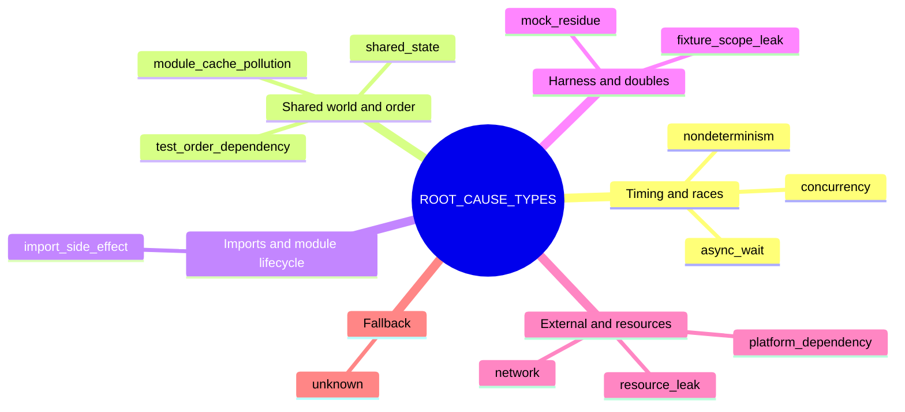
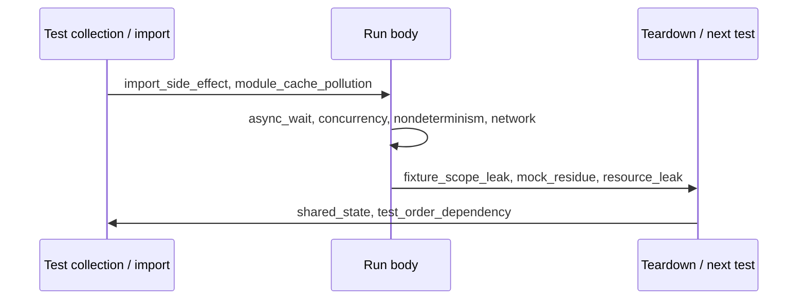
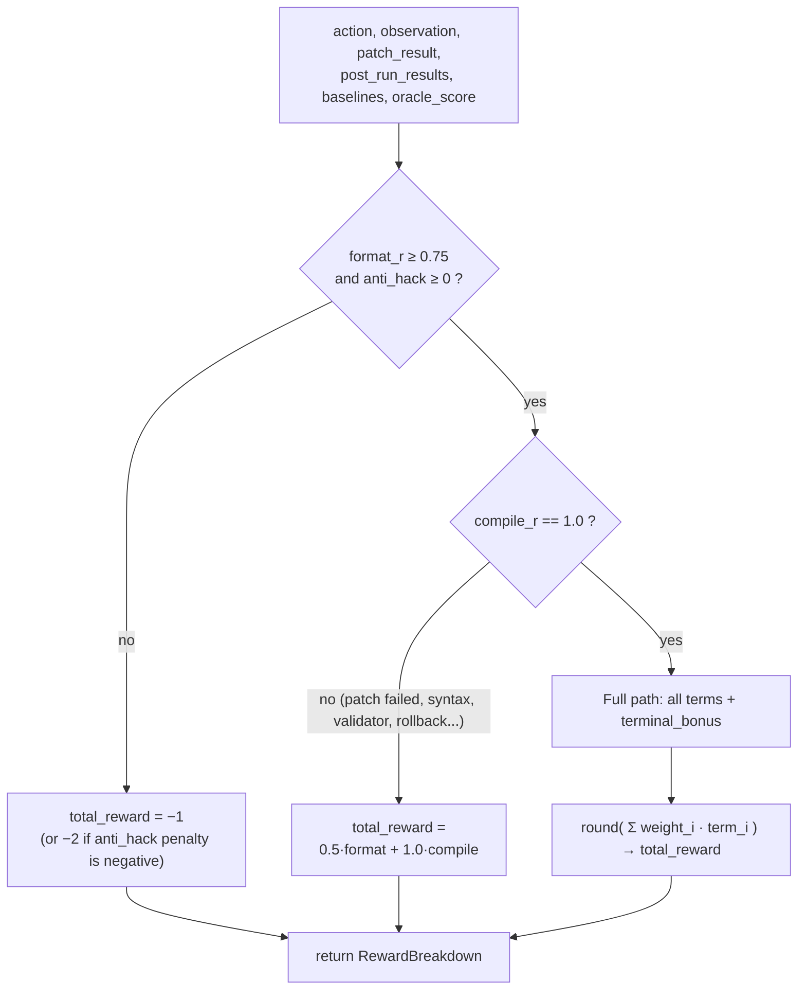
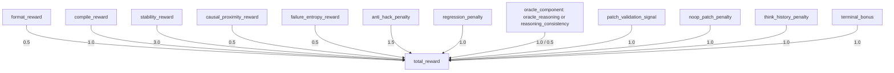
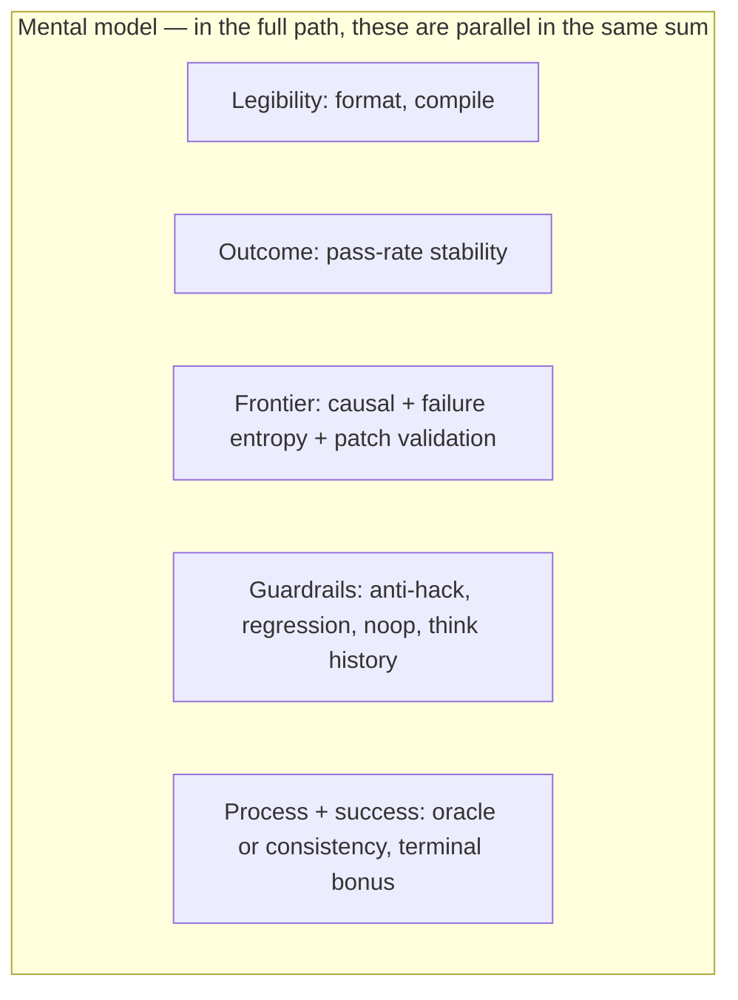

# FlakeForge

[](https://huggingface.co/docs/hub/spaces)
[](https://www.python.org/)
[](https://huggingface.co/)
[](https://pytorch.org/)
[](https://fastapi.tiangolo.com/)
[](https://www.docker.com/)
[](https://docs.pydantic.dev/)
[](https://www.uvicorn.org/)

**FlakeForge** is an [OpenEnv](https://pypi.org/project/openenv-core/)–style reinforcement learning **environment** for learning to **repair flaky Python tests**. The world is (mostly) deterministic: repeated `pytest` runs, AST scans, and static checks produce structured observations. The only learned piece is the policy (your code model); reward is **verifiable** from execution and static oracles, not an LLM judge.

---

## Table of contents

1. [Intuition and inspiration](#1-intuition-and-inspiration)
   - [Flaky test root causes (visual taxonomy)](#flaky-test-root-causes-visual-taxonomy)
2. [Problem we solve](#2-problem-we-solve)
3. [Environment interface (POMDP view)](#3-environment-interface-pomdp-view)
4. [Observation space](#4-observation-space)
5. [Action space (unified agent)](#5-action-space-unified-agent)
6. [Root-cause categories](#6-root-cause-categories)
7. [Unified agent: what it outputs and what it sees](#7-unified-agent-what-it-outputs-and-what-it-sees)
8. [Core tooling](#8-core-tooling)
   - [Causal graph engine](#causal-graph-engine)
   - [Deep flakiness scanners](#deep-flakiness-scanners)
9. [Verification stack: oracle engine and patch validator](#9-verification-stack-oracle-engine-and-patch-validator)
10. [Verifiable reward system](#10-verifiable-reward-system)
   - [Visual: gate pipeline](#visual-gate-pipeline)
   - [Visual: weighted sum of terms](#visual-weighted-sum-of-terms-full-path-only)
11. [OpenEnv config and commands](#11-openenv-config-and-commands)
12. [Build, run, and test locally](#12-build-run-and-test-locally)
   - [Inference log (`outputs/inference.log`)](#inference-log-outputsinferencelog)
13. [Deploy on Hugging Face Spaces](#13-deploy-on-hugging-face-spaces)
14. [RL training (Unsloth, curriculum)](#14-rl-training-unsloth-curriculum)
15. [Repository layout](#15-repository-layout)
16. [Contributing](#16-contributing)

---

## 1. Intuition and inspiration

Flaky tests are a major source of **wasted CI time** and **wrong signals** for both humans and ML. Classic fixes (bigger timeouts, more retries, blanket skips) often **mask** symptoms while hiding deeper bugs. We wanted a setting where an agent is pushed toward **structural, minimal fixes** that **survive repeated validation**—closer to how a senior engineer reasons (hypothesis → small edit → re-run) than to a one-shot “rewrite the file” code completion task.

**Inspiration** comes from three lines of work: (1) **POMDP / RL** for sequential decision making under partial observability, (2) **software engineering** research on flaky-test patterns (concurrency, order, I/O, shared state, fixtures, mocks, imports), and (3) **verifiable** training signals: what you can *measure* in pytest output and in the repo’s AST beats what you can only *opine* with another LLM.

### Flaky test root causes (visual taxonomy)

A **flaky test** is one that **sometimes passes and sometimes fails** for the **same version** of the code. The *symptom* is always “CI is noisy”; the *cause* is usually **hidden shared state**, **timing**, or **environment** coupling. FlakeForge labels hypotheses with the **`ROOT_CAUSE_TYPES`** enum in `models.py` (used in structured `think` claims). Below is how those labels relate to each other and what they mean in practice.

**Map — how the official categories cluster** (read the table after the diagrams for details):



**Conceptual chain** (how families interact—not separate bugs, but **layers** that stack): **timing races** expose **shared mutable state**; **imports and caches** make that state global; **fixtures and mocks** can spread or hide it; **network/platform** and **leaks** turn small races into **order-dependent** failures. Use the table below for precise definitions.

**Lifecycle view — where nondeterminism sneaks in** (collection → run → teardown):



| Category | What typically goes wrong | Why the outcome flickers | Fix direction (high level) |
|----------|-----------------------------|----------------------------|----------------------------|
| **`async_wait`** | `async`/`await` misuse, wrong timeout, background tasks not awaited | Event-loop scheduling and I/O completion order change between runs | Correct `await`, bounded waits, deterministic async teardown |
| **`concurrency`** | Threads, locks, shared mutable state without proper synchronization | Race windows open/close depending on CPU scheduling | Narrow critical sections, proper locks/events, avoid data races |
| **`test_order_dependency`** | Test A leaves state that test B reads; suite order varies | Different collection or parallel workers → different interleaving | Isolate tests, reset globals, avoid cross-test dependencies |
| **`resource_leak`** | Files, sockets, threads, subprocesses not closed | Later tests hit **FD limits**, port exhaustion, or zombie processes | Deterministic `close()` / context managers, pool limits in tests |
| **`shared_state`** | Globals, class attributes, singletons, mutable defaults | Leftover mutations change assertions on the next run | Reset in fixtures, copy-on-write test data, no module-level mutation |
| **`network`** | Real HTTP/DB without hermetic doubles | Latency spikes, rate limits, remote flakiness | Mocks, recorded responses, local fakes, retry policy in **SUT** not tests |
| **`platform_dependency`** | Paths, clocks, timezones, OS-specific APIs | CI image vs laptop differs; wall-clock assumptions | `pathlib`, inject clock, freeze time in tests, portable APIs |
| **`nondeterminism`** | Unseeded randomness, iteration over unordered sets, wall-clock timing in logic | Different values or ordering each run | Seed RNG, sort for stability, replace “sleep for sync” with signals |
| **`import_side_effect`** | Module body runs DB/network/setup on import | Import order or first-import timing changes global state | Move side effects behind `main()` or explicit init functions |
| **`module_cache_pollution`** | `sys.modules` / `@lru_cache` / process-wide caches retain stale data | “First import wins”; order defines cache contents | Clear caches in teardown, avoid process-wide caches in tests, reload strategy |
| **`fixture_scope_leak`** | `session`/`module`-scoped fixtures mutate shared resources | Wide scope + mutation leaks across tests | Narrow fixture scope, factory fixtures, explicit reset fixtures |
| **`mock_residue`** | `patch`/`mock` not stopped or leaks into imports | Later tests see patched symbols or half-mocked deps | `with patch(...)`, `addCleanup`, pytest plugins that enforce cleanup |
| **`unknown`** | Signal is weak or cause is outside the taxonomy | Needs more observation or human triage | Gather more runs, shrink repro, refine category |

**Related labels:** `RELATED_CATEGORIES` in `models.py` defines **soft neighbors** (e.g. `async_wait` ↔ `concurrency`) so small taxonomy mismatches in the model’s `think` block do not get punished as harshly during **reasoning consistency** reward.

---

## 2. Problem we solve

**Given** a repository and a test identifier, **stabilize** the failure mode so that the target test (and, ideally, the rest of the suite) passes **repeatably** under the configured runner, without “reward hacking” (weakening assertions, broad `except:`, `skip` markers, or sleeping forever).

The environment therefore:

- Establishes a **baseline** (preflight: sanity, determinism, flakiness) before training credit is spent.
- Surfaces **diagnostics** the policy can lean on: stack-derived failure frontier, call chain, I/O “boundary” hints, a **causal** view of the code path, and **AST-only “deep” flakiness** signals.
- Accepts a **unified** agent turn: structured **diagnosis** + **patch** in one step, then **re-executes** tests and returns **scalar reward** with a full **breakdown** for debugging and GRPO.

---

## 3. Environment interface (POMDP view)

| Concept | In FlakeForge |
|--------|----------------|
| **State** (hidden) | Server-side `FlakeForgeState` + git-like snapshots of the repo, episode counters, pass rates, etc. |
| **Observation** | `FlakeForgeObservation` JSON: sources, trees, preflight, deep signals, causal hints, run history, last reward, and more. |
| **Action** | `FlakeForgeAction`: unified think + patch (structured JSON and/or free-text for parsing). |
| **Transition** | `reset` → (optional) configure repo/test; `step` → validate → apply patch → run tests → compute reward. |
| **Reward** | `compute_verifiable_reward` in `server/reward.py` → `RewardBreakdown` and scalar `total`. |

The HTTP layer is created with **OpenEnv**’s `create_app(FlakeForgeEnvironment, FlakeForgeAction, FlakeForgeObservation)`; see `server/app.py` and `openenv.yaml`.

---

## 4. Observation space

The main payload is `FlakeForgeObservation` in `models.py`. At a high level, each step exposes:

| Block | Role |
|-------|------|
| **Localisation** | `test_function_source`, `source_under_test`, `file_tree`, `relevant_imports`, `async_markers` |
| **Run dynamics** | `run_history` (`RunRecord`: pass, duration, error_type, stderr excerpt), `current_pass_rate`, `baseline_pass_rate` |
| **Preflight** | `env_type`, `should_train`, `preflight_result` (three-stage gate: sanity, determinism, flakiness) |
| **Deep flakiness (AST, fast)** | `module_cache_violations`, `fixture_scope_risks`, `mock_residue_sites`, `import_side_effect_files`, `async_contamination_alive` |
| **Causal** | `failure_frontier` (file:line:func from stack), `call_chain_to_frontier`, `boundary_crossings` (e.g. HTTP/DB hints), `causal_graph` (summary dict), `causal_hints` |
| **Failure shape** | `failing_stack_trace`, `failure_pattern_summary`, `duration_fingerprint` |
| **Probes** | `order_dependency_detected`, `infrastructure_sensitive` (chaos / stress sensitivity) |
| **Policy feedback** | `patches_applied`, `total_diff_lines`, `think_history` (per-step summary for de-duplication and prompts), `last_think_text`, `last_patch_text`, `last_reward`, `reward_breakdown` |
| **Termination** | `done`, `done_reason` |

The observation is the **ground truth** the unified agent is prompted with on each turn (plus recent history) — see `agent/unified_agent.py` for prompt construction.

---

## 5. Action space (unified agent)

V3 uses a **single** high-level action type: **`UNIFIED_PATCH`**. The policy does **not** pick from seven discrete “tool names” in the old Gym sense; it emits a **JSON object** (preferred) with:

- **`think`** — `StructuredThink`: list of `ThinkClaim` items (category, entity, `path::Class.func` `location`, polarity, reason, etc.).
- **`patch`** — `StructuredPatch`: list of `PatchHunk` with `file`, `search`, `replace` (grounded search/replace over real sources).

`FlakeForgeAction` also carries `raw_response`, `think_text`, `patch_text`, and `predicted_category` / `predicted_confidence` for parsers and heuristics.

**Intuition:** the “action space” is **constrained by validation**, not a small enum. Invalid JSON, non-matching `search` blocks, unsafe edits, and hack patterns are rejected or penalized; valid minimal edits that move pass rate and match the **failure frontier** score highest.

---

## 6. Root-cause categories

The canonical list is **`ROOT_CAUSE_TYPES`** in `models.py`. Each value is documented with symptoms and fix direction in **[§1 — Flaky test root causes](#flaky-test-root-causes-visual-taxonomy)** (Mermaid mindmap, lifecycle sequence diagram, and reference table).

`RELATED_CATEGORIES` defines **soft** relatedness for **reasoning consistency** reward when the model’s stated category and the patch-inferred category differ slightly.

---

## 7. Unified agent: what it outputs and what it sees

**`UnifiedFlakeForgeAgent`** (`agent/unified_agent.py`) is the **JSON-first** interface to your base model. It:

- Builds a long context from the current **`FlakeForgeObservation`** (test code, SUT, signals, run summaries, and history).
- Enforces a **strict JSON** shape (no markdown fences) with **one claim line** in the system prompt; patch hunks use **verifiable** one-line `search` anchors where possible.
- Parses model output into `structured_think` and `structured_patch` when present.

**What the model “sees”** is exactly what you put in the observation: flaky vs stable preflight, pass rates, stack frontier, **deep** flags, and causal summaries — the sort of information you would give a human before asking for a **minimal** fix.

---

## 8. Core tooling

### Causal graph engine

*Implementation: `server/causal_graph.py`.*

**Purpose:** Build a **directed, cross-file** view from the test entry into user code, marking **async**, **call depth**, and **external boundaries** (HTTP, DB, queue, gRPC) where non-determinism or ordering often enters.

- **Input:** repository root, test / entry heuristics, configurable depth.
- **Output:** a `CausalGraph` (nodes, edges, boundary warnings) rendered into `FlakeForgeObservation.causal_graph` and short **`causal_hints`** for the LLM.
- **Why it matters:** Patches that edit files **far** from the **failure frontier** or **causal** neighborhood are easy to down-weight; see **causal_proximity_reward** in `server/reward.py`.

### Deep flakiness scanners

*Implementation: `server/deep_flakiness.py`.*

**Purpose:** Inexpensive **AST-only** checks that mirror real flaky patterns from SE literature:

- Module-level **caches** / mutable defaults / globals (`@lru_cache`, mutable list defaults, etc.)
- **Fixture** scope and yield/teardown issues
- **`mock.patch`** without proper teardown
- **Import-time** side effects
- **Async/thread** “leftover” heuristics

`build_deep_observation_signals(repo_path)` returns a small dict; the environment copies fields onto the observation so the **policy** and **reward** can use them as **hard features** (no model call).

---

## 9. Verification stack: oracle engine and patch validator

### Oracle engine (`server/oracle_engine.py`)

**Question:** *Is the structured **think** consistent with the **code** and the **patch**?*

- Uses **AST** and optional **LibCST** for static checks.
- Resolves `ThinkClaim.location` to real sources; checks things like **sync primitives** for concurrency-style claims, and whether hunks **address** the claimed locus.
- `verify_structured_think` produces a scalar **`oracle_score`** used in reward when available.

This is **not** a “judge model”: it is **code-facing** and **template-aware**, intended to be reproducible and cheap.

### Patch validator (`server/patch_validator.py`)

**Question:** *Is the patch **well-formed**, **applicable**, and **not obviously abusing** the reward?*

**Stages** (from module docstring):

1. **Format** — search/replace blocks, headers, basic hygiene  
2. **Simulate** apply — `search` must match the file (via `simulate_search_replace_patch`)  
3. **Syntax** — `ast.parse` on post-patch text  
4. **Compile** — per-module `compile` check  
5. **Structure** — heuristics (e.g. empty bodies, control-flow red flags)  
6. **Causal proximity (warning)** — far-from-frontier warnings  

**Invalid patches are rejected *before* disk write** in `FlakeForgeEnvironment.step`. The validator can emit a **score** (`validation_score`) that flows into **patch_validation_signal** in reward when the patch actually applies.

---

## 10. Verifiable reward system

Training a policy on **natural-language “scores” from another LLM** is fast to prototype but fragile: the judge can be **gamed**, **biased toward fluent nonsense**, and **misaligned** with what CI actually cares about (repeatable green builds). FlakeForge instead follows a classic principle from **reinforcement learning** and **program repair** research: put most of the learning signal on **outcomes and checks you can re-run**, then add **light shaping** so credit goes to edits that look like real engineering—not clever ways to pass a rubric.

**Reading map (how the pieces fit):**

1. **Gates first** — If the action is not parseable or the patch does not apply cleanly, there is little point in interpreting test outcomes; the environment **short-circuits** to a strong negative total (see below). This mirrors *constraint-based* action spaces in RL and *reject sampling* in repair pipelines.
2. **Primary outcome** — **Pass rate** under repeated `pytest` is the main “task reward”; shaping uses a **potential function** of pass rate so improvements are comparable across episodes.
3. **Secondary structure** — Proximity to the **failure frontier**, **entropy** of failure *types*, and **anti-hack** heuristics encode inductive biases from flaky-test studies and APR practice: fix the **right** place, collapse **chaotic** failure modes, and do not **delete** the test’s meaning.
4. **Reasoning channel** — When the **oracle** (`verify_structured_think`) runs, it supplies a **code-grounded** score; otherwise a lighter **category consistency** term ties the stated root cause to what the patch actually does.

`compute_verifiable_reward` in `server/reward.py` assembles a **`RewardBreakdown`**. The table below is the **contract**; the **weights** and **thresholds** in code are authoritative (see the `breakdown.total_reward = round(...)` block and the gate on `format_reward` / `compile_reward` / `anti_hack_penalty`).

| Signal | Role |
|--------|------|
| **format_reward** | Parses structured think/patch; rewards valid claims/hunks; falls back to text markers if needed. |
| **compile_reward** | Patch applied, syntax/compile path; negative if **validator rejected** or not applied. |
| **stability_reward** | **Potential-based** shaping on pass rate: \(\Phi(p)=p^2\), difference vs baseline. |
| **causal_proximity_reward** | Edits **near** `failure_frontier` / call chain; uses boundary metadata. |
| **failure_entropy_reward** | Lower entropy of error **types** after the step is better (more “single failure mode”). |
| **anti_hack_penalty** | Counters assertion weakening, `sleep` insertion, `except:`, `skip` markers, huge diffs, etc. |
| **regression_penalty** | Other tests failing after edit. |
| **reasoning_consistency_reward** / **oracle_reasoning_reward** | Category match (heuristic) vs **oracle** path when `oracle_score` is present. |
| **patch_validation_signal** | From `PatchValidator` **score** (when applied). |
| **noop_patch_penalty** | Trivial or no-op edits that still “succeed” mechanically. |
| **think_history_penalty** | Repeating the same diagnosis without new evidence. |
| **terminal_bonus** | Large bonus when pass rate hits **1.0** or major improvements. |

### Visual: gate pipeline

Reward is not a single scalar from pytest alone: the implementation **short-circuits** bad actions before the full mix applies, so GRPO can still get gradient signal from “partially right” cases without crediting real hacks. This matches the control flow in `compute_verifiable_reward` (`server/reward.py`).



*Legibility: “compile_r” is `compile_reward`; gates use the same thresholds as the code (`format_reward < 0.75`, `anti_hack_penalty < 0.0`, `compile_reward < 1.0`).*

### Visual: weighted sum of terms (full path only)

When the full branch runs, **every term** below is a field on `RewardBreakdown`. Arrows show **which signals are scaled by which coefficient** in the final `total_reward = round(...)` sum (the diagram is a structural map, not a causal ordering).



**How to read it:** the **largest** coefficient is **stability** (3.0): repeated `pytest` outcomes drive learning once patches apply. **Format** and **compile** are the usual “can we even run the experiment?” preconditions. **Anti-hack** and **regression** scale penalties so shortcuts and cross-test damage can dominate smaller shaping gains. The **oracle** path uses `oracle_score` when present (`oracle_reasoning` ×1.0); otherwise **reasoning consistency** (×0.5).



*The table above is still the full contract; **weights in `server/reward.py`** are authoritative if this doc and code diverge.*

### Intuition per signal (why it is there)

- **format_reward** — A structured **hypothesis + edit** is easier to validate, audit, and compose with oracles than a blob of prose. This is the same motivation as *chain-of-thought* interfaces in tool-using agents: separate **intent** from **mechanism** so downstream code can check both.
- **compile_reward** — Program repair literature treats **plausible but non-compiling** patches as a dominant failure mode; rewarding **apply + parse + compile** filters a huge class of spurious edits before tests even speak.
- **stability_reward** (\(\Phi(p)=p^2\)) — Squaring pass rate makes **late** progress toward a fully green suite **more** valuable than the same absolute gain from a very red baseline, which matches the “last mile” cost of killing residual flakes. Formally, the step reward uses a **potential difference** \(\Phi(p_{\text{after}})-\Phi(p_{\text{before}})\), which preserves the **optimal policy** under standard assumptions (see references below).
- **causal_proximity_reward** — Flaky failures often localize to a small **dynamic slice** of the codebase; patches that edit the **frontier file** or **stack neighborhood** are more likely to be **minimal** and **causal** than edits three modules away. This aligns with **fault localization** and **minimal repair** goals in APR.
- **failure_entropy_reward** — If every rerun fails differently, the system is still **non-stationary** from the agent’s perspective. **Collapsing** diversity of `error_type` labels is a cheap proxy for “we moved from chaotic nondeterminism toward a **single** addressable failure mode”—consistent with how flaky-test studies categorize **order-, async-, and state-dependent** symptoms.
- **anti_hack_penalty** — Any scalar reward invites **Goodharting**: weaken assertions, swallow exceptions, skip tests, or sleep until races vanish. Penalties target **known** shortcuts so the policy cannot trade away **semantic** test intent for **numeric** reward (see **specification gaming** references).
- **regression_penalty** — A fix that **breaks neighbors** is not acceptable in CI; this term encodes a **multi-test** notion of correctness familiar from regression testing research.
- **oracle_reasoning_reward** vs **reasoning_consistency_reward** — When the oracle runs, reasoning is graded by **static alignment** between claims, locations, and hunks—closer to **process supervision** (“check the steps”) than to an LLM grader. Without the oracle, a lighter **taxonomy** match keeps the stated category from drifting entirely away from the patch.
- **patch_validation_signal**, **noop_patch_penalty**, **think_history_penalty** — Respectively: reward **quality of application** beyond binary success, block **empty** credit loops, and nudge the policy away from **repeating** the same ineffective narrative when the environment has not changed.
- **terminal_bonus** — Sparse **success** signals (full pass or large jumps) are emphasized so GRPO-style training does not drown in **tiny** shaped increments.

### Hard short-circuit (credit only when basics pass)

If **format** is too low, **compile** is bad, or **anti_hack** is negative, the total is clamped to a **strong negative** (see the `if breakdown.format_reward < 0.75 or ...` block in `server/reward.py`) so the policy cannot grind partial credit on garbage.

### Weighted total

**Total** is a **weighted sum** of the terms above; coefficients are in the final `breakdown.total_reward = round(...)` assignment in `server/reward.py` (e.g. stability is up-weighted relative to format because **outcome** is the primary learning signal once gates pass).

### Research connections (selected)

These papers and reports are not an exhaustive bibliography, but they justify **why** each family of terms exists:

| Theme | Pointer | Relevance to FlakeForge |
|-------|---------|-------------------------|
| **Potential-based shaping** | Ng, Harada, Russell, [*Policy Invariance Under Reward Transformations: Theory and Application to Reward Shaping*](https://people.eecs.berkeley.edu/~russell/papers/icml99-shaping.pdf) (ICML 1999) | Justifies \(\Phi(p)=p^2\) and **difference** shaping so auxiliary reward does not invent spurious optima (implementation comment in `server/reward.py`). |
| **Flaky tests (empirics)** | Luo et al., [*An Empirical Analysis of Flaky Tests*](https://dl.acm.org/doi/10.1145/2635868.2635920) (FSE 2014) | Motivates **repeatable** evaluation, **order/async** failure modes, and why **pass-rate stability** must be central. |
| **Process / verifiable feedback** | Lightman et al., [*Let’s Verify Step by Step*](https://arxiv.org/abs/2305.20050) (ICLR 2024) | Intuition for **oracle_score**: reward **checkable** reasoning traces, not just final answers. |
| **Outcome training for reasoning** | Uesato et al., [*Solving Math Word Problems with Process- and Outcome-based Feedback*](https://arxiv.org/abs/2211.14275) (2022) | Complements the above: **outcome** (pytest) + **process** (oracle) hybrid. |
| **Specification gaming** | Krakovna, [*Specification gaming examples in AI*](https://vkrakovna.wordpress.com/2018/04/02/specification-gaming-examples-in-ai/) (blog, 2018); Amodei et al., [*Concrete Problems in AI Safety*](https://arxiv.org/abs/1606.06565) (2016) | Motivates **anti_hack** and **hard gates**: misspecified rewards invite **perverse** shortcuts. |
| **Program repair context** | Monperrus, [*Automatic Software Repair: A Bibliography*](https://hal.science/hal-01956501v1/document) (ACM CSUR 2018) | Surveys **compile-time** filters, **localization**, and **regression** awareness—same structural pressures as this reward stack. |
| **Group RL for LLMs** | Shao et al., [*DeepSeekMath: Pushing the Limits of Mathematical Reasoning in Open Language Models*](https://arxiv.org/abs/2402.03300) (2024) | **GRPO**-style training benefits from **low-variance**, **comparable** rewards across a group; `RewardBreakdown` is designed for exactly that kind of logging and advantage estimation. |

**Intuition in one line:** *Reward what **pytest and static checks** can verify, punish **hacks and regressions**, and gently align **stated** diagnosis with **actual** code change—using shaping theory so the extras do not fight the main objective.*

---

## 11. OpenEnv config and commands

`openenv.yaml` pins the app entry point:

```yaml
spec_version: 1
name: FlakeForge
type: space
runtime: fastapi
app: server.app:app
port: 8000
```

**Typical commands (from a clone of this repo, repo root = `CWD`):**

| Task | Command |
|------|--------|
| Install deps (pip) | `pip install -r server/requirements.txt` |
| **Run ASGI** (dev) | `uvicorn server.app:app --host 0.0.0.0 --port 8000` |
| **Run** (if the package is installed with `[project.scripts]`) | `uv run server --port 8000` (see `test_repos/SETUP.md`) |
| **Docker** | `docker build -t flakeforge-env:latest -f server/Dockerfile .` then run with published `8000` |
| **HTTP health** | `GET http://localhost:8000/health` |
| **Episode (HTTP API)** | `POST /reset` with JSON body; then `POST /step` with action fields (see `client.py` and OpenEnv’s handler) |

**Hugging Face Hub CLI (optional) — push Space files:**

```bash
hf auth login
hf upload <user>/FlakeForge . --type space
```

(Use your Space repo id. Requires `huggingface_hub` / [`hf` CLI](https://huggingface.co/docs/huggingface_hub/main/en/guides/cli).)

The Space UI in this project serves `templates/index.html` at `/` and adds showcase routes under `/api/*` (see `server/api_showcase.py`).

---

## 12. Build, run, and test locally

**In-process (Python):** with the package installed (`pip install -e .` or your env manager):

```python
from FlakeForge.server.FlakeForge_environment import FlakeForgeEnvironment
from FlakeForge.models import FlakeForgeAction

env = FlakeForgeEnvironment()  # optional: repo_path, test_identifier
obs = env.reset()
# Build FlakeForgeAction with your model or tests; then:
# result = env.step(action)  # return shape from OpenEnv Environment API
```

If you run from a source checkout without installing, set `PYTHONPATH` to the repo root and use `from server.FlakeForge_environment import FlakeForgeEnvironment` (and `from models import ...` as in `tests/`).

**HTTP client:** see `client.py` (`FlakeForgeClient.run_episode_remote`) for `httpx` calls to `POST /reset` and `POST /step` against `ENV_BASE_URL`.

**Image build** uses `server/Dockerfile` (see top of that file for `HEALTHCHECK` and `uvicorn` entrypoint).

### Inference log (`outputs/inference.log`)

Running **`python inference.py`** (with your usual args for repo path, test id, and model) appends **structured episode logs** to **`outputs/inference.log`** (see `inference.py`: the logger is created with that path). The same run also **prints the full episode result as JSON** to stdout when the script finishes, so you can copy a trajectory for post-mortems. That JSON is the in-memory `episode_result` from `run_episode`: `trajectory` (per-step think/patch/reward), `total_reward`, `final_pass_rate`, and `done_reason`. For long runs, use **`scripts/plot_inference_episode.py`** to turn that JSON into a **multi-panel figure** (see below) instead of reading thousands of lines in the console.

**Example: bad policy on a queue-under-load / concurrency case.** The episode below is from a run against a **small worker-pool** fixture (flaky test exercising **`WorkerPool`** and **`QUEUE_CAPACITY`** in `source.py`, in the same family as `test_repos/moderate_load_jitter_flaky`—concurrent submissions vs a tight queue). The model repeatedly **raises queue capacity** and insists the root cause is “small capacity → false failures,” but **pass rate never moves off zero** and the session ends on **`regression_detected`**.

**Why the agent is poor here (reward-aligned):**

- **Patch quality:** Step 1 replaces `QUEUE_CAPACITY = 5` with `WorkerPool.QUEUE_CAPACITY = 10` in a way that is **not a valid or stable edit** to the class body (the breakdown still shows `compile` 1.0 in some steps, but the trajectory illustrates **fuzzy/fragile** edits and later `patch_applied: false` when search text no longer matches). The policy **fixates** on a single knob instead of the actual failure mode the tests encode.
- **No measurable improvement:** `pass_rate` is **0.0** every step, so the environment never sees **stability** improve; that keeps **`stability` negative** and exposes **regression** risk when the patch moves the code away from the reference behavior.
- **Reasoning not grounded in execution:** **Oracle / reasoning** terms (`oracle_reasoning`, and related breakdown fields) stay negative: the high-confidence **concurrency** narrative does not match what **pytest** can verify, so the verifiable stack punishes “sounds right but isn’t” claims.
- **Repetition without learning:** `think_history` turns negative in later steps—similar claims and the same class of capacity tweak yield **increasingly wasteful** trajectories.
- **Outcome:** **`total_reward`: -24.55**, **`done_reason`:** `regression_detected`, after eight steps still at **`final_pass_rate`: 0.0**. This is exactly the kind of run you want the reward to make **unattractive** for training or evaluation: confident language, **no** pass-rate lift, and **guardrail** terms firing.

**Visual dashboard (same run as the JSON in `data/inference_example_episode.json` — step rewards, cumulative reward, pass rate vs confidence, patch apply markers, a heatmap of every `reward_breakdown` key per step, and traces for a few components):**


Regenerate the figure after changing the example JSON (or pipe your own saved stdout to a `.json` file):

```bash
uv pip install -e ".[viz]"   # or: pip install matplotlib numpy
python scripts/plot_inference_episode.py -i data/inference_example_episode.json -o docs/assets/inference_episode_dashboard.png
```

The full machine-readable episode is in [`data/inference_example_episode.json`](data/inference_example_episode.json) (`trajectory`, `total_reward`, `final_pass_rate`, `done_reason`, `reward_breakdown_history`).

---

## 13. Deploy on Hugging Face Spaces

1. **Create** a new Space; set **SDK** to **Docker** (matches this repo’s README front matter: `sdk: docker`).
2. **Port:** `app_port: 8000` (already in the YAML front matter of this `README.md`).
3. **Container:** Hugging Face expects a `Dockerfile` at the **repository root** of the Space. This repository ships the canonical image in **`server/Dockerfile`**. For Spaces, add a **root** `Dockerfile` with the same content (or `COPY` pattern), e.g.:

   ```dockerfile
   FROM python:3.11-slim
   WORKDIR /app
   RUN apt-get update && apt-get install -y --no-install-recommends git curl stress-ng iproute2 \
       && rm -rf /var/lib/apt/lists/*
   COPY server/requirements.txt /app/server/requirements.txt
   RUN pip install --no-cache-dir -r /app/server/requirements.txt
   COPY . /app/
   HEALTHCHECK --interval=10s --timeout=3s --start-period=10s --retries=5 \
       CMD curl -f http://localhost:8000/health || exit 1
   EXPOSE 8000
   ENTRYPOINT ["uvicorn", "server.app:app", "--host", "0.0.0.0", "--port", "8000"]
   ```

4. **Environment (optional):** set `FF_REPO_PATH` to point at a **bundled** repo in the image (default in code: `test_repos/timing_race_minimal` under the project root) or your checked-in fixture.
5. **Push** via Git (recommended) or `hf upload` as above. Wait for the build; the UI should load at the Space URL.

**Note:** The OpenEnv `create_app` stack exposes `GET /health`, `POST /reset`, and `POST /step` like other OpenEnv HTTP servers. OpenAPI may be at `/docs` if enabled by your `openenv-core` version.

---

## 14. RL training (Unsloth, curriculum)

**Idea:** GRPO rollouts use **`FlakeForgeEnvironment`**, **structured JSON** actions, and **`compute_verifiable_reward`** — no LLM judge for the main training signal.

**Current stack (after latest improvements):**

- **Unsloth GRPOTrainer** (default) — fast path vs vanilla TRL; strong Qwen2.5 support; 4-bit QLoRA
- **Curriculum** with 3 stages (Easy → Medium → Hard)
- **Manifest-grounded** scenarios under `test_repos/synthetic/`, `data/manifests/`, and `data/curriculum_stages/`

**Install training deps and run the driver:**

```bash
uv pip install -r training-requirements.txt
python -m training.train_grpo --model Qwen/Qwen2.5-7B-Instruct --max-episodes 500
```

**Notes:**

- Unsloth is **required** for the default training path; the script fails fast with install hints if it is missing.
- Outputs use the **V3** JSON shape `{"think": {...}, "patch": {...}}`.
- W&B project defaults to `flakeforge-rl` when enabled.
- The notebook `FlakeForge_RL_Training (2).ipynb` is kept in sync with this pipeline conceptually; **`training/train_grpo.py`** is the main entry.

---

## 15. Repository layout (selected)

| Path | Role |
|------|------|
| `models.py` | Schemas: action, observation, state, `RewardBreakdown` |
| `openenv.yaml` | OpenEnv manifest: FastAPI `server.app:app` |
| `server/app.py` | App factory, static UI route, showcase router |
| `server/FlakeForge_environment.py` | `reset` / `step`, preflight, runner, observations |
| `server/reward.py` | Verifiable reward and breakdown |
| `server/oracle_engine.py` | Static oracle over claims and patches |
| `server/patch_validator.py` | Patch simulation and safety |
| `server/causal_graph.py` | Causal graph builder |
| `server/deep_flakiness.py` | AST “deep” signals |
| `server/docker_runner.py` | pytest / Docker test execution |
| `agent/unified_agent.py` | JSON-first agent and prompts |
| `client.py` | Remote HTTP client example |
| `inference.py` | LLM-driven episodes; logs to `outputs/inference.log`, prints final JSON |
| `scripts/plot_inference_episode.py` | Build PNG dashboard from episode JSON (optional: `pip install -e ".[viz]"`) |
| `data/inference_example_episode.json` | Example episode export for docs / plots |
| `docs/assets/` | Committed figures (e.g. inference dashboard PNG) |
| `training/` | GRPO and curriculum |


## 16. Contributing

- **Issues & PRs:** Bug reports and small, focused PRs are welcome. Please describe **repro** (repo path, test id, command) and, if possible, a **failing** vs **expected** reward or observation.
- **Scope:** Prefer changes that keep the **environment deterministic** and **reward** tied to **measurable** criteria.
- **Style:** Match existing typing, docstrings, and module boundaries (`models` / `server` / `agent` / `training`).
- **Code of conduct:** Be constructive and specific in review; we optimize for **clarity and reproducibility** over sheer benchmark scores.
